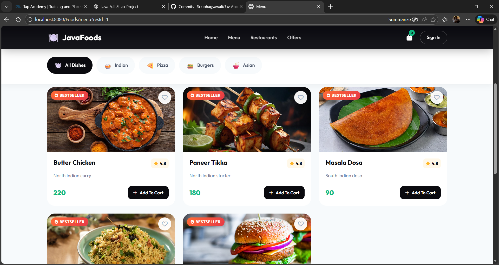
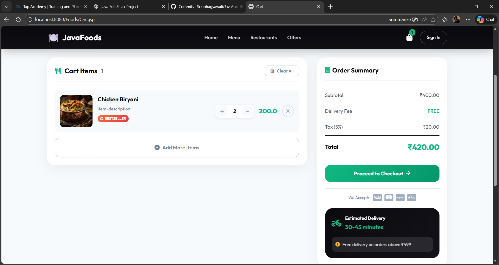

# 🍽️ Food Ordering Web Application

A full-stack **Java-based Food Ordering Web Application** developed using **MVC architecture** and the **DAO design pattern**.  
This project simulates a real-world online food ordering system with dynamic data handling and database integration.

---

## 🚀 Project Overview

This application allows users to:
- Browse available restaurants
- View dynamic menus
- Add food items to the cart
- Place orders seamlessly

The project focuses on backend logic, clean architecture, and real-time data flow between UI and database.

---

## 🛠️ Tech Stack

- **Backend:** Java, JSP, Servlets  
- **Database:** MySQL  
- **Data Access:** JDBC  
- **Design Pattern:** DAO (Data Access Object)  
- **Architecture:** MVC (Model–View–Controller)  
- **Frontend:** HTML, CSS  
- **Version Control:** Git & GitHub  

---

## 🧩 Architecture Used

### MVC Architecture
- **Model:** Java classes + DAO for database operations  
- **View:** JSP pages for UI rendering  
- **Controller:** Servlets to handle requests and responses  

### DAO Pattern
- Ensures separation of business logic and database logic  
- Improves maintainability and scalability  
- Centralizes all JDBC operations  

---

## 📌 Features

- Dynamic restaurant and menu listing
- Cart management
- Order placement
- Secure and structured database interaction
- Clean separation of layers using MVC + DAO

---

## 📷 Screenshots

### 🏠 Home Page


### 🍴 Menu Page


### 🛒 Cart Page


---

## 🗂️ Project Structure

```text
Foods
│
├── src/main/java
│   ├── Servlets/
│   ├── dao/
│   ├── daoImplementation/
│   ├── model/
│   ├── utility/
│
├── webapp/
│   ├── assets/
│   │   └── images/menu/
│   │   └── screenshots/
│   ├── jsp/
│   ├── css/
│
├── README.md


---

## 🧠 What I Learned

- Building end-to-end Java web applications
- Implementing MVC and DAO in real projects
- JDBC connectivity and database design
- Debugging backend and request flow issues
- Using Git & GitHub for version control

---

## 🔗 LinkedIn Project Post

👉 [View Project Showcase on LinkedIn](https://www.linkedin.com/posts/soubhagya-wali-84867a327_javafullstack-javadeveloper-webdevelopment-activity-7412809185899479040-QI_V)

---

## 📬 Feedback

Feedback and suggestions are always welcome.  
This project helped me strengthen my **backend fundamentals** and gain confidence in Java Full Stack development.

---

### ⭐ If you like this project, consider giving it a star!
